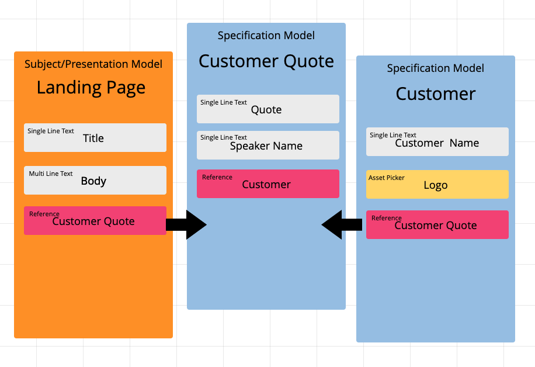

# GraphCMS Next.js Demo

> Statically generating pages by fetching data from GraphCMS with Next.js

## Instructions

```
$ git clone https://github.com/LauraBeatris/graphcms-nextjs-demo.com.git
$ cd laurabeatris.com
$ cp .env.local.example .env.local
$ yarn
$ yarn dev
```

Define the environment variables by creating a .env.local file similar to [.env.local.example](https://github.com/LauraBeatris/graphcms-nextjs-demo/blob/master/.env.local.example)

## Content Modeling

<p align="center">
   
</p>